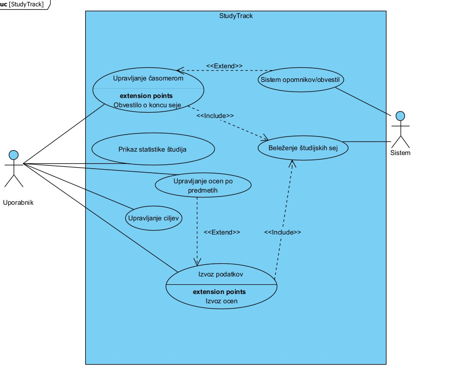
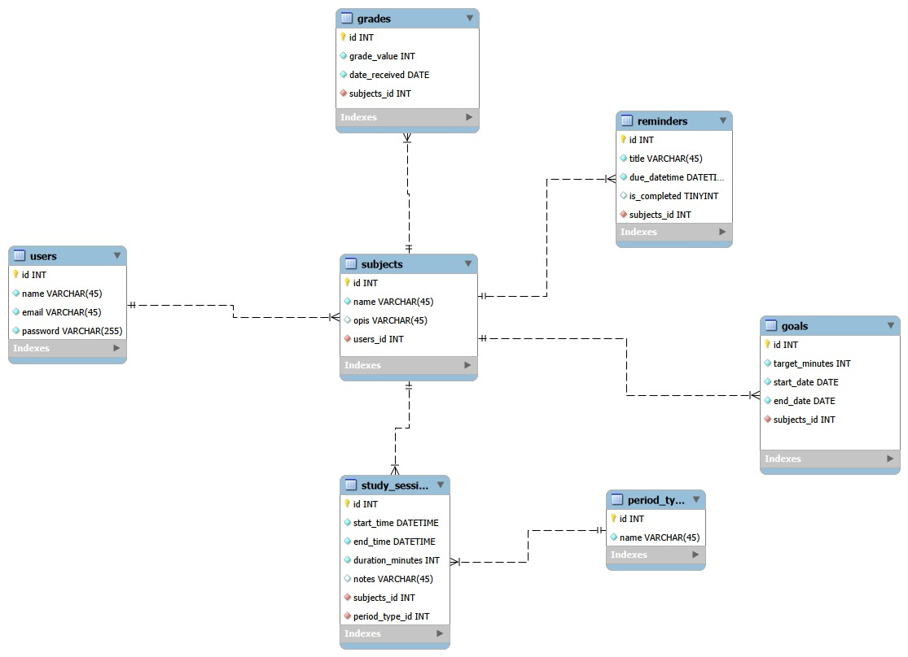
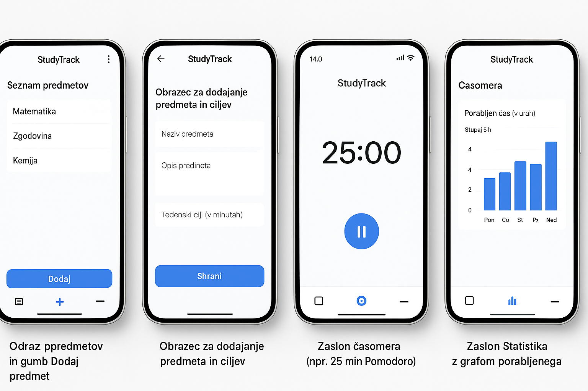

# StudyTrack

**StudyTrack** je mobilna Android aplikacija, razvita v Flutterju, ki uporabnikom pomaga spremljati čas učenja, načrtovati študijske obveznosti in analizirati napredek s pomočjo statističnih prikazov.  
Aplikacija omogoča uporabo časomera, vodenje evidence učenja po predmetih, upravljanje ocen in ciljev ter pregled nad statistiko učenja.

Podatki so shranjeni lokalno, zato aplikacija deluje tudi brez internetne povezave.

---

## Ključne funkcionalnosti

1. **Časomer**  
   - Zagon, pavziranje in zaključek učne seje  
   - Izbira predmeta in trajanja seje  
   - Ob zaključku seje aplikacija prikaže obvestilo

2. **Beleženje študijskih sej in statistika**  
   - Shranjevanje vsake zaključene seje (datum, trajanje, predmet)  
   - Pregled zgodovine učenja  
   - Grafični prikazi porabe časa po predmetih in dneh

3. **Upravljanje predmetov in ciljev**  
   - Dodajanje, urejanje in brisanje predmetov  
   - Nastavitev tedenskih in mesečnih ciljev (v minutah)  
   - Povezava ciljev z dejansko porabljenim časom učenja

4. **Sistem opomnikov in obvestil (push notifikacije)**  
   - Opomniki na nedosežene cilje učenja  
   - Obvestila o nedokončanih nalogah ali premalo učenja pri določenem predmetu

5. **Upravljanje ocen po predmetih**  
   - Dodajanje ocen za posamezen predmet  
   - Izračun in prikaz povprečja  
   - Prikaz napredka uspešnosti pri predmetu

6. **Uvoz in izvoz podatkov**  
   - Izvoz podatkov o študijskih sejah in ocenah v **JSON** ali **CSV**  
   - Možnost varnostne kopije podatkov ali prenosa na drugo napravo

---

## Uporabljene tehnologije

- **Flutter** 
- **Android** 
- **Lokalna baza** 

---

## Diagrami 

### Diagram primerov uporabe

Diagram prikazuje glavna akterja aplikacije **StudyTrack** – uporabnika in sistem – ter njihove interakcije s ključnimi funkcionalnostmi.  
V diagramu so zajeti glavni primeri uporabe, ki jih aplikacija omogoča:

- upravljanje časomerom in beleženje študijskih sej  
- sistem opomnikov in obvestil  
- prikaz statistike študija  
- upravljanje ocen po predmetih  
- upravljanje ciljev  
- izvoz podatkov  

**Diagram:**  


---

### Shema podatkovne baze (ER diagram)

Podatkovni model aplikacije StudyTrack vključuje več glavnih entitet, ki pokrivajo upravljanje uporabnikov, predmetov, študijskih sej, ciljev, opomnikov in ocen.  
Primeren je za shranjevanje celotnega napredka učenja in podporo funkcionalnostim aplikacije.

**Glavne tabele v podatkovni bazi:**

- `users` – podatki o uporabnikih  
- `subjects` – seznam predmetov, povezanih z uporabnikom  
- `study_sessions` – zabeležene študijske seje  
- `grades` – ocene po predmetih  
- `goals` – učni cilji (časovni cilji)  
- `reminders` – opomniki povezani s predmeti  
- `period_types` – tipi obdobij (npr. tedensko, mesečno)

**ER diagram:**  

---

## Zaslonske slike (mockupi)

Spodaj je prikazan primer vizualnega izgleda ključnih zaslonov aplikacije **StudyTrack**:

- seznam predmetov in gumb **Dodaj predmet**  
- obrazec za dodajanje novega predmeta in ciljev  
- zaslon časomera   
- zaslon **Statistika** z grafičnim prikazom učenja  

**Slika zaslonov:**  


##  Namestitev in zagon (Flutter)

1. Namesti **Flutter SDK** in Android Studio / emulator.  
2. Odpri terminal in se postavi v korensko mapo projekta.  
3. Zaženi naslednja ukaza:

```sh
flutter pub get
flutter run
```

## Vodič za uporabo (ključna funkcionalnost)

### Upravljanje predmetov in ciljev

1. Odpri aplikacijo **StudyTrack**.
2. Na spodnji navigaciji izberi zavihek **Predmeti**.
3. Klikni gumb **Dodaj predmet**.
4. Vnesi naslednje podatke:
   - **naziv predmeta** (npr. *Matematika*)  
   - **opis predmeta** (opcijsko)  
   - **tedenski ali mesečni cilj**
5. Klikni **Shrani**.
6. Novi predmet se prikaže na seznamu.
7. S klikom na posamezen predmet lahko:
   - **urediš podatke o predmetu**,  
   - **pregledaš cilje**,  
   - **dodajaš ali pogledaš ocene**,  
   - **ustvariš opomnik**,  
   - **odpreš statistiko učenja** povezanega s tem predmetom.
